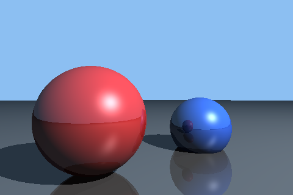
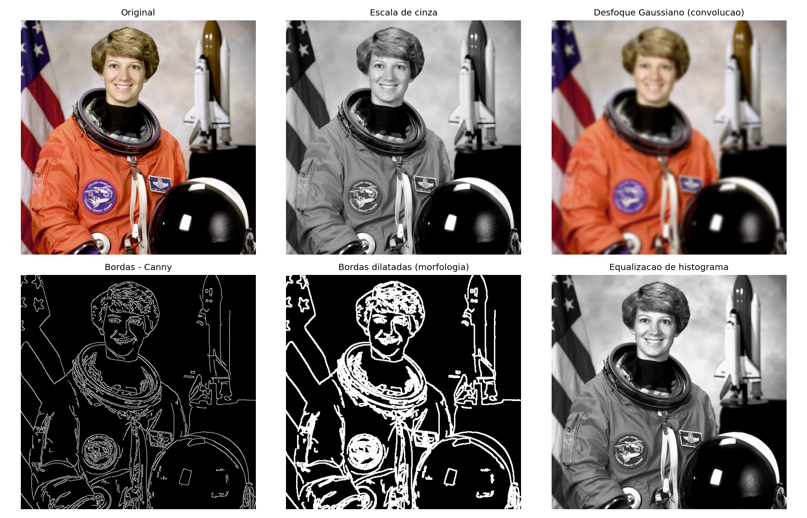
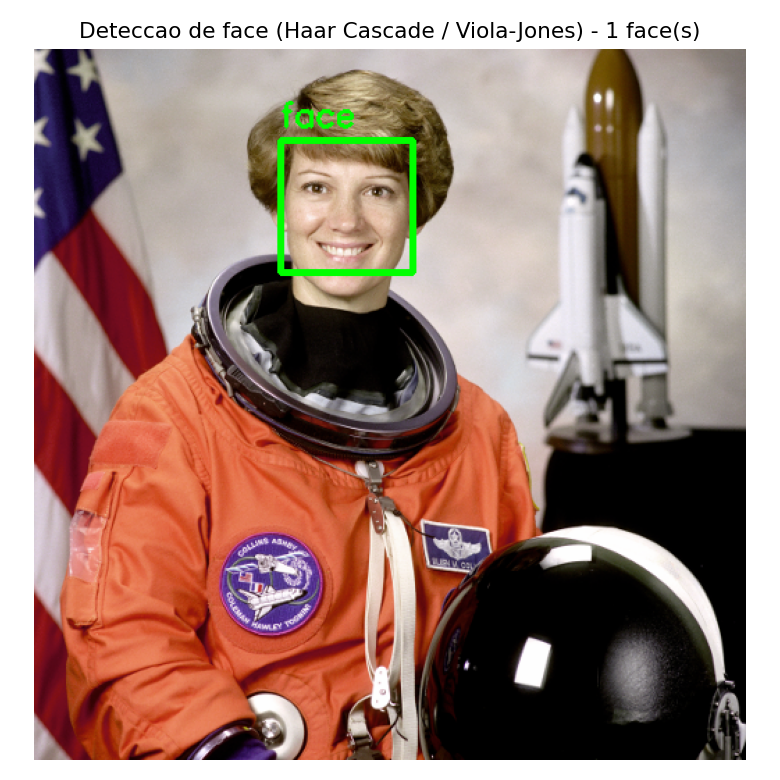
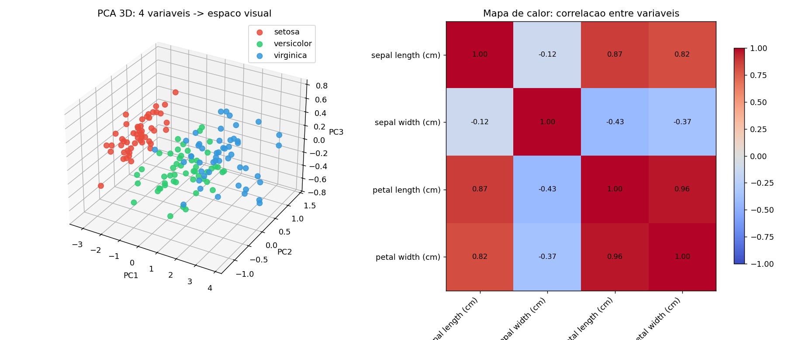

# Computação Visual: Síntese de Imagens, Processamento de Imagens, Visão Computacional e Visualização Computacional

## 1. Panorama geral

"Computação Visual" (*Visual Computing*) é o guarda-chuva que reúne todas as áreas que relacionam **computador** e **imagem**. Elas se diferenciam basicamente pela **direção do fluxo de informação**:

| Área | Entrada | Saída | Pergunta que responde |
|---|---|---|---|
| **Síntese de Imagens** (Computação Gráfica) | Modelo 3D / descrição matemática da cena (geometria, luz, câmera, materiais) | Imagem 2D | "Como fica visualmente essa cena que ainda não existe?" |
| **Processamento de Imagens** | Imagem | Imagem (transformada) | "Como melhorar/transformar esta imagem?" |
| **Visão Computacional** | Imagem | Informação simbólica / decisão (rótulos, coordenadas, classes) | "O que existe nesta imagem e onde?" |
| **Visualização Computacional** | Dado abstrato (numérico, tabular, científico) | Imagem/gráfico | "Como representar visualmente este dado para que um humano o compreenda?" |

Um jeito simples de lembrar: **Síntese** cria imagens a partir de descrições; **Processamento** transforma imagens em outras imagens; **Visão** extrai significado de imagens; **Visualização** transforma dados (que nem sempre têm forma visual natural) em imagens.

Para cada área foi selecionada uma aplicação clássica, executada abaixo com código Python (bibliotecas: NumPy, OpenCV, scikit-image, scikit-learn, Matplotlib), com os respectivos resultados e explicações.

---

## 2. Síntese de Imagens (Computação Gráfica)

**Aplicação escolhida:** Ray Tracer (traçado de raios) simples, estilo Whitted (1980) — algoritmo público e clássico, reproduzido em incontáveis repositórios educacionais (ex.: *"Ray Tracing in One Weekend"*, raytracers minimalistas em Python/NumPy).

**Principais aspectos da área:**
- Parte de um **modelo matemático da cena**: geometria (esferas), posição de câmera, posição e cor da luz, materiais (cor difusa, componente especular, reflexão).
- Simula o **transporte da luz**: para cada pixel, um raio é lançado da câmera até a cena; calcula-se interseção raio–objeto, normal da superfície, sombreamento (Lambert + Blinn-Phong), sombras (raios secundários até a luz) e reflexão recursiva.
- A imagem **não existia antes** — ela é *sintetizada* a partir de números (equações de esfera, vetores de luz).
- Contraste com Visão Computacional: aqui o "conhecimento" da cena (posição exata de cada objeto) é dado de entrada; na Visão Computacional esse conhecimento é o que se quer *descobrir* a partir da imagem.

**Execução (código em `1_sintese_raytracer.py`):**
```python
def trace_ray(O, D, depth=0):
    # 1) encontra o objeto mais proximo interceptado pelo raio (O, D)
    # 2) calcula ponto de interseccao P e normal N
    # 3) testa sombra lancando raio secundario ate a luz
    # 4) soma componente difusa (Lambert) + especular (Blinn-Phong)
    # 5) se o material reflete, lanca raio refletido recursivamente
    ...
```
Resultado: duas esferas (vermelha fosca e azul) sobre um "chão" cinza, com sombras projetadas, realce especular (brilho) e reflexão visível na esfera azul.



---

## 3. Processamento de Imagens

**Aplicação escolhida:** pipeline clássico de filtros com OpenCV (suavização Gaussiana, detecção de bordas Canny, operação morfológica de dilatação e equalização de histograma) aplicado sobre uma fotografia real.

**Principais aspectos da área:**
- Entrada **já é uma imagem existente** (aqui, uma foto real de astronauta, dataset de exemplo do scikit-image).
- Operações são majoritariamente **locais e matemáticas**: convolução (filtro Gaussiano borra a imagem combinando vizinhança de pixels com pesos), gradiente de intensidade (Canny detecta bordas onde há variação abrupta de intensidade), operação de conjunto/morfologia (dilatação expande regiões de bordas) e redistribuição estatística de intensidades (equalização de histograma aumenta contraste global).
- **Não há interpretação de "o que é" o conteúdo** — o algoritmo não sabe que existe um rosto humano ali; ele apenas processa números de pixel.
- Domínio: pixel → pixel (ou vizinhança de pixels → pixel), sem saída simbólica.

**Execução (código em `2_processamento_imagens.py`):** aplica `cv2.GaussianBlur`, `cv2.Canny`, `cv2.dilate` e `cv2.equalizeHist` sobre a imagem, comparando os seis resultados lado a lado.



---

## 4. Visão Computacional (Visão Artificial)

**Aplicação escolhida:** detecção de rosto com classificador **Haar Cascade** (algoritmo Viola–Jones, 2001) — modelo pré-treinado público, distribuído dentro do próprio OpenCV (`haarcascade_frontalface_default.xml`), amplamente usado em repositórios de detecção facial em tempo real.

**Principais aspectos da área:**
- Usa a **mesma imagem** de entrada do exemplo anterior, mas a saída muda de natureza: em vez de outra imagem, o algoritmo devolve **coordenadas (x, y, largura, altura)** de uma região onde há alta probabilidade de existir um rosto — ou seja, uma **decisão/interpretação simbólica** sobre o conteúdo.
- O classificador foi **treinado previamente** (aprendizado de máquina, boosting em cascata sobre características tipo Haar) em milhares de exemplos positivos e negativos de rostos — diferente do processamento de imagens, que não exige nenhum "conhecimento prévio" do que está sendo processado.
- Objetivo cognitivo: replicar uma capacidade humana (reconhecer/localizar rostos), etapa inicial típica de sistemas maiores de Visão Computacional (reconhecimento facial, contagem de pessoas, vigilância, biometria).

**Execução (código em `3_visao_computacional.py`):**
```python
face_cascade = cv2.CascadeClassifier(cv2.data.haarcascades + "haarcascade_frontalface_default.xml")
faces = face_cascade.detectMultiScale(gray, scaleFactor=1.1, minNeighbors=5, minSize=(60, 60))
```
Resultado: 1 rosto detectado corretamente, com retângulo verde delimitando a região.



---

## 5. Visualização Computacional

**Aplicação escolhida:** visualização do dataset científico **Iris** (4 variáveis numéricas: comprimento/largura de sépala e pétala, sem nenhuma natureza espacial ou visual intrínseca), reduzido a 3 dimensões via PCA e representado em gráfico de dispersão 3D, acompanhado de mapa de calor de correlação.

**Principais aspectos da área:**
- A entrada é **dado abstrato/numérico** (uma tabela), não uma imagem nem uma cena 3D descrita geometricamente — não existe "forma" natural para esses dados até que alguém escolha como mapeá-los no espaço visual (eixos, cores, posição).
- O foco é **comunicar padrões e relações** que seriam difíceis de perceber olhando só os números: aqui, a separação visual dos três grupos de flores após redução de dimensionalidade, e a intensidade de correlação entre variáveis no mapa de calor.
- Diferente da Síntese de Imagens (onde a geometria da cena já é conhecida e fixa), na Visualização é preciso **decidir/projetar** como o dado abstrato vira geometria (aqui, PCA decide os 3 eixos que mais preservam a variância dos dados).
- Diferente da Visão Computacional (que interpreta imagens para gerar símbolos), a Visualização faz o caminho oposto: **símbolos/números → imagem**, para apoiar a interpretação humana.

**Execução (código em `4_visualizacao_computacional.py`):** `PCA(n_components=3)` projeta as 4 variáveis originais em 3 eixos (que explicam juntos ~99,6% da variância) e `np.corrcoef` gera a matriz de correlação exibida como *heatmap*.



---

## 6. Síntese comparativa final

| Aspecto | Síntese de Imagens | Processamento de Imagens | Visão Computacional | Visualização Computacional |
|---|---|---|---|---|
| Entrada típica | Modelo 3D / cena geométrica | Imagem | Imagem | Dado abstrato/numérico |
| Saída típica | Imagem | Imagem | Símbolos, classes, coordenadas | Imagem/gráfico |
| Direção do processo | Geometria → pixel | Pixel → pixel | Pixel → significado | Dado → geometria/pixel |
| Exemplo aplicado | Ray tracing (esferas com sombra e reflexão) | Filtros (blur, Canny, equalização) | Detecção de face (Haar Cascade) | PCA 3D + mapa de calor (Iris) |
| Requer aprendizado prévio (ML)? | Não (baseado em física/matemática da luz) | Não (operadores fixos) | Frequentemente sim (classificadores treinados) | Não necessariamente (pode usar estatística/PCA) |
| Palavra-chave | Renderização | Transformação | Interpretação | Comunicação/Mapeamento |

Todas as quatro áreas compartilham a mesma base matemática (álgebra linear, geometria, processamento de sinais) e frequentemente se combinam em pipelines reais — por exemplo, um jogo usa Síntese para renderizar a cena, um filtro de câmera usa Processamento para melhorar a imagem antes de exibi-la, um carro autônomo usa Visão Computacional para detectar pedestres, e um painel de monitoramento usa Visualização para mostrar sensores em tempo real.

---

### Arquivos desta entrega
- `relatorio_computacao_visual.md` — este relatório
- `1_sintese_raytracer.py`, `out_1_sintese.png`
- `2_processamento_imagens.py`, `out_2_processamento.png`
- `3_visao_computacional.py`, `out_3_visao.png`
- `4_visualizacao_computacional.py`, `out_4_visualizacao.png`
